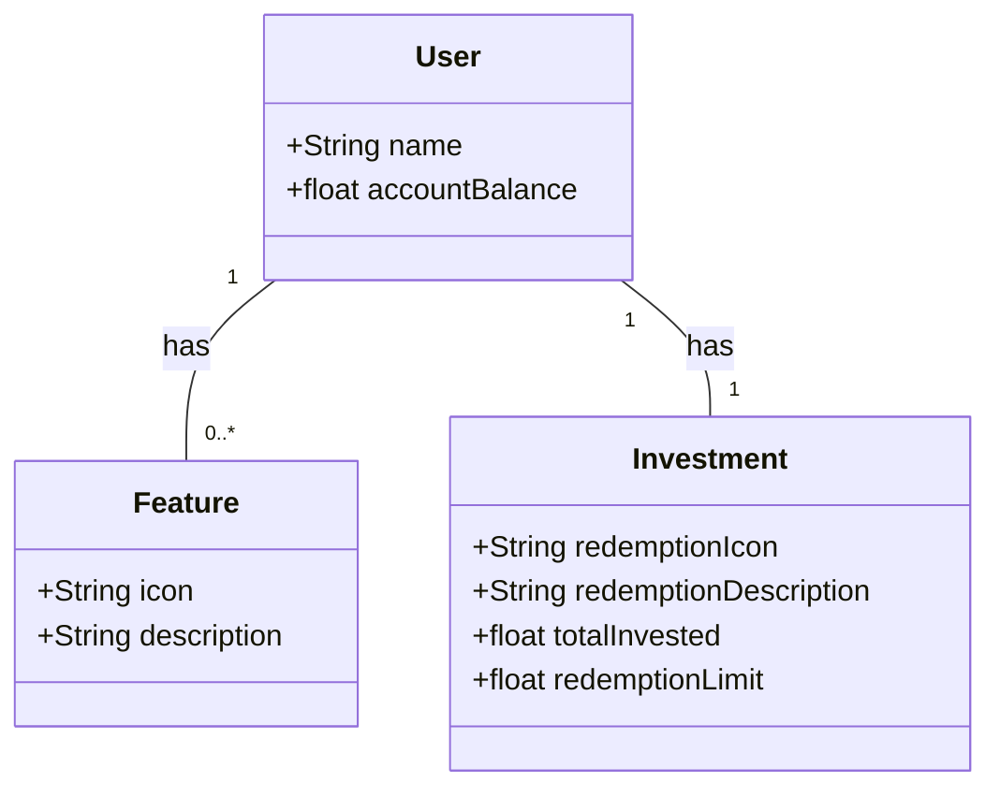

# GFT-Desenvolvimento-Java-com-IA

## Descrição

Este repositório contém uma API RESTful desenvolvida como parte do Bootcamp "GFT-Desenvolvimento-Java-com-IA". O projeto foi criado para fornecer uma solução prática e funcional em Java, utilizando conceitos de desenvolvimento de APIs RESTful e Inteligência Artificial.

## Estrutura do Projeto

A API RESTful inclui as seguintes características e funcionalidades:

- **Gerenciamento de Usuários**: Permite a criação, leitura, atualização e exclusão de usuários.
- **Processamento de Dados**: Integra funcionalidades de IA para processamento e análise de dados.
- **Endpoints RESTful**: Implementa endpoints para interações com os dados da aplicação.

## Tecnologias Utilizadas

- **Java**: Linguagem principal para desenvolvimento da API.
- **Spring Boot**: Framework para criar e gerenciar a aplicação RESTful.
- **Inteligência Artificial**: Técnicas e bibliotecas de IA para processamento de dados.
- **JUnit**: Ferramenta para testes unitários.
- **Swagger**: Documentação da API.

## Configuração do Projeto

Para rodar o projeto localmente, siga os passos abaixo:

1. **Clone o Repositório**

   ```bash
   git clone https://github.com/KaduSR/GFT-Desenvolvimento-Java-com-IA.git

2. **Navegue para o Diretório do Projeto**

    ```bash
   cd GFT-Desenvolvimento-Java-com-IA

3. **Instale as Dependências**

    Certifique-se de ter o Maven instalado e execute o comando:  
   
   ```bash
   mvn install
    
4. **Execute a Aplicação**

   Use o comando Maven para iniciar a aplicação:  
   
   ```bash
   mvn spring-boot:run

5. **Acesse a Documentação da API**

Após a aplicação estar rodando, você pode acessar a documentação da API em:

```bash
https://localhost:8080/swagger-ui/index.html
```

## Diagrama de classe



**Contribuições**

Contribuições são bem-vindas! Sinta-se à vontade para abrir issues ou pull requests para melhorar o projeto.


**Licença**

Este projeto está licenciado sob a [Licença MIT](https://choosealicense.com/licenses/mit/). Veja o arquivo LICENSE para mais detalhes.


Sinta-se à vontade para fazer quaisquer ajustes conforme necessário!
